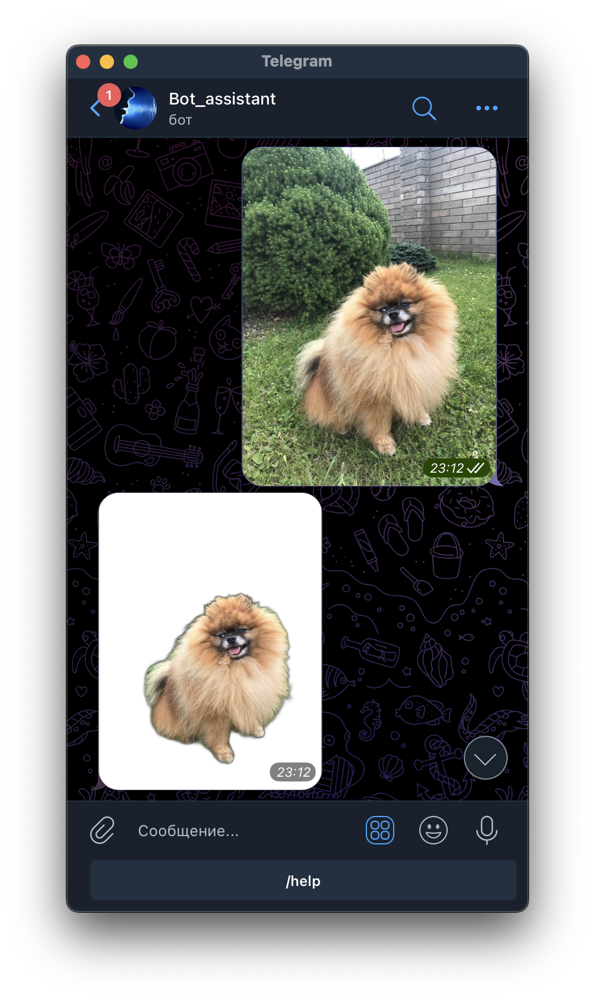

# Bot_assistant
## @Voice_converting_textBot - телеграм бот

Бот разработан с помощью библиотеки Telebot

## Основной функционал и команды

1. /start - Запуск бота. 
2. /help - Выводит справку по командам бота.
3. Удалять фон c изображения, загрузи изображение и нажми отправить.
4. Конвертировать голос в текст, запиши голос на диктофон.
5. Конвертировать PDF в mp3, загрузи pdf файл и нажми отправить.
6. Добавляет нового пользователя в БД.

### Подключение
1. Клонируйте репозиторий и перейдите в него в командной строке: https://github.com/IgorYKovalev/Bot_assistant.git
2. Установите виртуальное окружение: `python -m venv <название>`
3. Активируйте виртуальное окружение: `source venv/Scripts/activate`
4. Установите зависимости: `pip install -r requirements.txt`
5. Создайте файл .env и добавьте в него свой: TOKEN

### Запуск
Находясь в папке проекта, запустите файл в терминале main.py
`python main.py`

### Как разместить бота на бесплатном хостинге pythonanywhere.com
"""
Переходим на https://www.pythonanywhere.com/
1. Регистрируемся на сайте
2. Создаем файл со скриптом бота:
    В разделе Files нажимаем кнопку "+ Open another file" → вводим имя файла tg_bot.py → нажимаем кнопку "Open"
    Копируем содержимое файла в последней ячейке с кодом
    Возвращаемся на главную страницу
3. Создаем консоль, через которую запустим бота:
    Под разделом Consoles есть раздел "New console", нажимаем кнопку "$ Bash"
    В открывшейся консоли выполняем команду `pip install pyTelegramBotAPI SpeechRecognition pydub`
    Запускаем бота командой `python tg_bot.py`
    Остановить бота можно комбинацией клавиш Ctrl+C
"""
